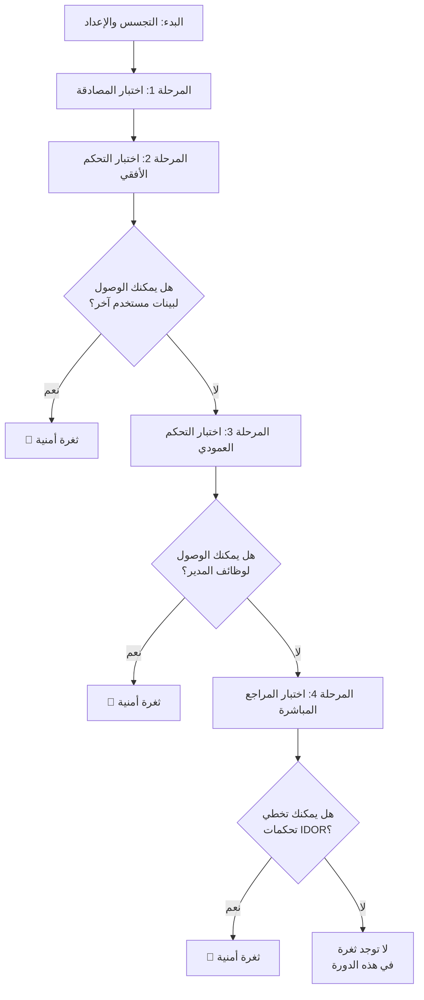

#### <mark style="background: #D2B3FFA6;">البدايه يوم 15-10-2025</mark>

# منهجية عملية للكشف عن ثغرات ( Access Control, IDOR )
## 🔍 خريطة العملية الشاملة

## **المرحلة <mark style="background: #ADCCFFA6;">1: اختبار إدارة المصادقة والجلسات</mark>**
تركز هذه المرحلة على بوابة التطبيق الرئيسية.

*   **الخطوة 1: إنشاء حسابات اختبار**: أنشئ حسابين مستخدمين على الأقل بنفس مستوى الصلاحية (مثل `مستخدم أ` و `مستخدم ب`). إذا أمكن، أنشئ حساب مدير.
*   **الخطوة 2: تحليل رموز الجلسة**: سجل الدخول كـ `مستخدم أ` وافحص ملف تعريف الارتباط أو الرمز. ثم سجل الدخول كـ `مستخدم ب` وانظر إذا كان هيكل الرمز مختلفاً.
*   **الخطوة 3: اختبار الإعدادات الخاطئة**: سجل الدخول كـ `مستخدم أ`، ثم استبدل رمز جلستك برمز `مستخدم ب` (أو المدير) دون تسجيل الخروج. إذا منحك هذا الوصول لبيانات `مستخدم ب`، فهذه ثغرة حرجة.

## **المرحلة <mark style="background: #ADCCFFA6;">2: اختبار التحكم الأفقي في الوصول</mark>**
يتحقق هذا من إمكانية وصولك لبيانات مستخدم آخر أو موارده بنفس مستوى الصلاحية.

*   **الخطوة 1: تعيين الطلبات الخاصة بالمستخدم**: أثناء تسجيل الدخول كـ `مستخدم أ`، حدد جميع الطلبات التي تجلب بياناتك الشخصية. مثلاً: طلب `GET` إلى `/api/users/123/profile`.
*   **الخطوة 2: التلاعب في المعاملات**: حاول الوصول لبيانات `مستخدم ب` بتغيير المعرّف في الطلب. مثلاً: غير الرابط من `/api/users/123/profile` (ملفك الشخصي) إلى `/api/users/124/profile` (ملف `مستخدم ب`). إذا استطعت رؤية ملف `مستخدم ب`، فقد وجدت ثغرة IDOR.
*   **الخطوة 3: اختبار طرق HTTP الأخرى**: لا تختبر طلبات `GET` فقط. جرب تغيير أو حذف البيانات عبر طلبات `POST`, `PUT`, `PATCH`, و `DELETE` باستخدام معرّف مورد مستخدم آخر.

## **المرحلة <mark style="background: #ADCCFFA6;">3: اختبار التحكم العمودي في الوصول</mark>**
يتحقق هذا مما إذا كان المستخدم العادي يمكنه تنفيذ إجراءات محجوزة لمستخدمين أعلى صلاحية.

*   **الخطوة 1: اكتشاف نقاط النهاية المميزة**: كمستخدم مدير، لاحظ الوظائف والروابط المتاحة لك فقط (مثل `/admin/user-manager`, `/api/admin/reports`).
*   **الخطوة 2: الوصول كمستخدم عادي**: اخرج من حساب المدير وسجل الدخول كمستخدم عادي (`مستخدم أ`). حاول الوصول مباشرة لروابط المدير التي اكتشفتها.
*   **الخطوة 3: تزوير الطلبات المميزة**: حتى لو كان قائمة المدير مخفية، حاول إرسال طلب HTTP مباشر لإنشاء مستخدم جديد أو حذف منشور.

## **المرحلة<mark style="background: #ADCCFFA6;"> 4: اختبار المراجع المباشرة غير الآمنة (IDOR</mark>)**
هذه نظرة مركزة على ثغرات IDOR.

*   **الخطوة 1: ابحث عن المعرّفات المتوقعة**: تستخدم التطبيقات عادة معرّفات رقمية متسلسلة، UUIDs، أو أسماء مستخدمين.
*   **الخطوة 2: جرب أنواع معرّفات مختلفة**: إذا كان لديك معرّف رقمي، جرب زيادته أو إنقاصه. إذا كان اسم مستخدم، جرب استبداله باسم مستخدم آخر.
*   **الخطوة 3: تخطي فحوصات "المصدر"**: بعض التطبيقات تتحقق من header `Referer`. جرب إزالته أو تعيينه لصفحة "مسموحة".

##  و <mark style="background: #FFF3A3A6;">💡 نصائح مهمة للاختبار الفعال</mark>

*   **الفحص من جانب الخادم هو الأساس**: الخطأ الشائع هو إخفاء زر أو رابط بدلاً من تنفيذ تحقق من جانب الخادم. **اختبر دائماً بإرسال طلبات مباشرة لخادم API**.
*   **السياق مهم**: تأثير ثغرة IDOR يعتمد على البيانات التي يتم الوصول لها.
إليك شرح مفصل لطريقة استخدام Burp Suite في اختبار الاختراق، من الإعداد الأولي إلى التنفيذ العملي.
---
### 🛠️ الأدوات الرئيسية في Burp Suite واستخدامها

| الأداة         | الوظيفة الرئيسية                                                             | استخدام في اختبار الاختراق                                                                |
| :------------- | :--------------------------------------------------------------------------- | :---------------------------------------------------------------------------------------- |
| **Proxy**⚙️    | اعتراض الطلبات والاستجابات بين المتصفح والخادم.                              | نقطة البداية لمراقبة وتحليل وتعديل كل حركة المرور يدوياً.                                 |
| **Repeater**🔁 | إعادة إرسال الطلب نفسه مراراً مع إدخال تعديلات طفيفة عليه.                   | مثالية للتجربة يدوياً واستكشاف ثغرات مثل حقن SQL (SQL Injection) أو كسر كلمات المرور.     |
| **Intruder**⚔️ | أتمتة هجمات إرسال عدد كبير من الطلبات.                                       | إجراء هجمات القوة الغاشمة (Brute-force)، أو مسح المعلمات (Fuzzing) لاكتشاف ثغرات الإدخال. |
| **Scanner**🔍  | (في النسخة المدفوعة) المسح التلقائي للبحث عن ثغرات أمنية شائعة.              | اكتشاف ثغرات مثل XSS و SQL Injection تلقائياً وبسرعة.                                     |
| **Decoder**🔤  | ترميز (Encode) وفك ترميز (Decode) البيانات إلى صيغ مختلفة (مثل Base64, URL). | تحليل البيانات المشفرة التي يعترضها البروكسي أو تحضير حمولات (Payloads) مشفرة.            |
قائمة متكاملة ومنظمة لاختبار التطبيقات وتأمينها. مقسمة مراحلية مع خطوات عملية، أدوات، وكيفية تقييم الأثر وجمع الأدلة.

# 1 — إعداد/مدخلات

- حدد نطاق واضح (domains, subdomains, APIs, mobile, cloud).
    
- احصل على بيانات حسابات لكل دور (admin,user,guest) أو أنشئها.
    
- جهز أدوات: Burp Suite, Repeater, Intruder, ffuf/dirsearch, sqlmap, nmap, gobuster, ffuf, jwt_tool, curl, httpie, jq.
    
- جهز طريقة توثيق: ملف اختبار (spreadsheet) + أدلة (screenshots, pcap, طلب HTTP خام).
    
- عرف معايير التقييم: Confidentiality/Integrity/Availability + CVSS basics.
    

# 2 — استكشاف عام (Recon)

- passive: WHOIS, subdomain enumeration, crt.sh, robots.txt, sitemap.xml.
    
- active: nmap, portscan محدود، directory brute-force (ffuf).
    
- اجمع endpoints، ملفات JS، API base paths، 3rd-party domains.
    
- خزّن جميع الـURLs والـparams في جدول.
    

# 3 — خرائط التطبيق وفهم البزنس

- ارسم user flows أساسيين: تسجيل/دخول، دفع، رفع ملفات، تغيير بيانات.
    
- حدد “assets” حساسة: PII, tokens, keys, transactions.
    
- حدد ما يجعل كل نقطة هجوم عالية الأثر.
    

# 4 — التحقق من المصادقة (Authentication)

- اختبر كلمات مرور شائعة وبريتش فورس مع rate-limit مراقب.
    
- تحقق من استعادة كلمة المرور: token قابل للإعادة؟ قابل للتخمين؟ expiry؟
    
- تحقق من Multi-factor إن وُجد.
    
- تحقق من إبطال الجلسات بعد تغيير كلمة المرور.
    
- تحقق من استخدام Secure/HttpOnly/SameSite للكوكيز.
    

# 5 — تحكم الوصول (Access Control)

- IDOR: بدّل user_id, order_id في GET/POST.
    
- URL/endpoint protection: افتح /admin بدون صلاحية.
    
- Vertical vs Horizontal access checks.
    
- Business logic bypass: أنشئ موارد جديدة وتفاعل كدور مختلف.
    
- تحقق من server-side enforcement. لا تعتمد على client-side.
    

# 6 — Injection (SQL, NoSQL, Command)

- SQLi: اختبر في كل حقل/param قابل للإدخال. استخدم blind & error-based.
    
- NoSQLi: جرّب payloads خاصة بـ Mongo (e.g. `{"$ne": null}`).
    
- Command injection في أي مكان يقبل نظام ملفات/أوامر.
    
- احصل على evidence: DB error, timing differences, shell output.
    

# 7 — XSS (Stored, Reflected, DOM)

- اختبر كل حقل يعكس مدخلات المستخدم.
    
- احفظ payloads مُشفرة وراقب response.
    
- جرّب DOM XSS بواسطة JS files وpostMessage.
    
- جمع دليل: alert(1) أو screenshot يظهر الـpayload.
    

# 8 — CSRF

- تحقق من وجود CSRF tokens في POST/PUT/DELETE.
    
- جرّب تنفيذ الطلب من موقع خارجي بدون token.
    
- تحقق من SameSite cookie وسلوك CORS.
    

# 9 — SSRF

- فحص أي param يأخذ URL أو ملف.
    
- جرّب توجيه إلى burp collaborator أو controlled host.
    
- تحقق من الوصول للـmetadata servers (169.254.169.254).
    

# 10 — CORS وواجهات الـAPI

- تحقق من Access-Control-Allow-Origin، Access-Control-Allow-Credentials.
    
- تحقق من عدم السماح لأي origin مع credentials.
    
- تأكد أن الاستجابة التي تُعيد بيانات حساسة لا تسمح origin خارجي.
    

# 11 — File upload / Deserialization / RCE

- تحقق من extension/content-type validation.
    
- جرّب تحميل ملف فينهام باسم php/jsp مع content-type image.
    
- تحقق من deserialization vulnerabilities في Java/.NET/PHP.
    

# 12 — Configuration & Info Disclosure

- boom: robots.txt, .env, .git, backup files, default creds.
    
- HTTP headers: X-Frame-Options, HSTS, CSP.
    
- Error messages لا تكشف عن stack traces أو DB schema.
    

# 13 — التشفير (Crypto)

- تحقق من TLS (no TLS 1.0/1.1, valid cert, HSTS).
    
- تحقق من تخزين كلمات السر: bcrypt/argon2 مع salt.
    
- تحقق من نقل البيانات المشفرة (no sensitive data in URLs).
    

# 14 — الجلسات وإدارة التوكنات

- JWT: تحقق من alg none، key exposure، long expiry.
    
- تحقق من invalidation عند logout.
    
- تحقق من token binding إن وُجد.
    

# 15 — Rate limiting, Bruteforce, Enumeration

- اختبر محاولات تسجيل الدخول المتكررة.
    
- تحقق من enumeration عبر forgot-password/registration responses.
    

# 16 — Business logic flaws

- فحص السيناريوهات التي تسمح بتخفيض السعر، تكرار نقاط، تحويل أموال بدون تحقق.
    
- افصل بين functional tests وsecurity tests.
    

# 17 — Logging & Monitoring

- تحقق من وجود logging للـevents الحساسة.
    
- تحقق من عدم تسريب sensitive data في logs.
    

# 18 — Supply chain وCI/CD

- افحص ملفات config في repository المكشوف.
    
- تحقق من secrets في CI logs أو pipeline config.
    

# 19 — السحابة والبنية التحتية

- تحقق من S3 buckets عامة.
    
- تحقق من IAM policies واسعة جدًا.
    
- تحقق من metadata access وroles over-privileged.
    

# 20 — جمع الأدلة والـPoC

- لكل ثغرة خذ: raw request, response, screenshot, steps to reproduce, impact statement.
    
- استخدم Burp Collaborator أو controlled host للـout-of-band proofs.
    

# 21 — تصنيف وتحديد الأولويات

- استخدم مصفوفة: Impact (H/M/L) × Likelihood (H/M/L).
    
- اعطِ الأولوية: RCE, Auth bypass, Data exfiltration, Privilege escalation.
    

# 22 — تقرير الثغرات (template)

- Title
    
- Affected endpoint(s) + request/response (raw)
    
- Risk rating (CVSS or simple H/M/L)
    
- Steps to reproduce (numbered, reproducible)
    
- PoC (screenshots, burp requests, collaborator evidence)
    
- Impact (what data/ability attacker gains)
    
- Remediation guidance (concrete code/config changes)
    
- Notes (false positives, scope limits)
    

# 23 — نصائح عملية للترتيب اليومي

- يوم 1: Recon + mapping + login flows.
    
- يوم 2: Auth + Access control + session tests.
    
- يوم 3: Injection + XSS + CSRF.
    
- يوم 4: SSRF + File upload + Deserialization.
    
- يوم 5: Config, CORS, Info disclosure + report draft.
    
- كل يوم: سجّل الأدلة في ملف واحد وحدث قائمة الثغرات.
    

# 24 — أدوات سريعة للذكاء والعمل

- Burp (proxy, repeater, intruder).
    
- ffuf/dirsearch للـdirs.
    
- sqlmap للـSQLi.
    
- nmap لنطاق الشبكة.
    
- jwt_tool, jwt_cracker.
    
- Burp Collaborator للـOOB.
    

# 25 — خاتمة سريعة

- راجع دائماً من منظور الخادم لا الواجهة.
    
- ركّز على خطوات قابلة للتكرار وجمع الأدلة الخام.
    
- صنّف الثغرات بحسب التأثير والسهولة ثم قدم remediation واضحة.
    

